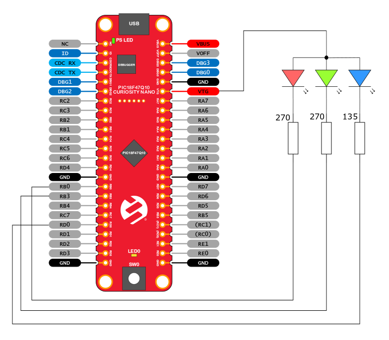
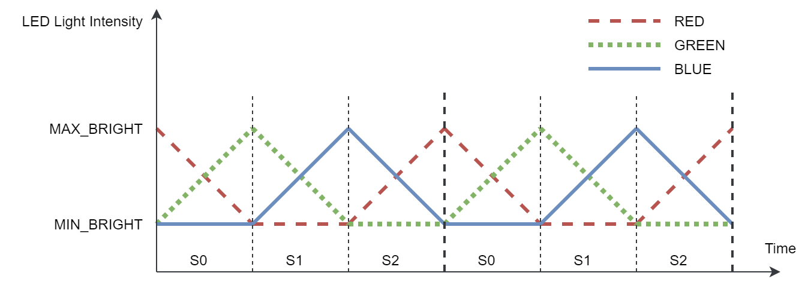

# PIC18F47Q10 PWM RGB-LED Using Interrupts

## Objective:
This repository contains an example of bare-metal code for PWM as described in [*TB3270 - Getting Started with PWM Using CCP on PIC18*](http://ww1.microchip.com/downloads/en/Appnotes/Getting-Started-with-PWM-Using-CCP-on-PIC18-DS90003270A.pdf) document from Microchip.
 The PIC18F47Q10 features four 10-bit PWM generators. In this demo, the CCP1, CCP2 and PWM3 peripherals in conjunction with TMR2 are used to produce PWM signals featuring a color game on an RGB LED.
Three GPIO pins are used as outputs: RB0, RB3 and RD0.

## Related Documentation
- [TB3270 - Getting Started with PWM Using CCP on PIC18](http://ww1.microchip.com/downloads/en/Appnotes/Getting-Started-with-PWM-Using-CCP-on-PIC18-DS90003270A.pdf)
- [PIC18-Q10 Product Family Page](https://www.microchip.com/design-centers/8-bit/pic-mcus/device-selection/pic18f-q10-product-family)
- [PIC18F47Q10 Data Sheet](http://ww1.microchip.com/downloads/en/DeviceDoc/40002043D.pdf)
- [TB3261 - PIC1000: Getting Started with Writing C-Code for PIC16 and PIC18](https://www.microchip.com/wwwappnotes/appnotes.aspx?appnote=en1002117)
- [PIC18F47Q10 Code Examples on GitHub](https://github.com/microchip-pic-avr-examples?q=pic18f47q10-cnano)

## Software Used
- MPLAB® X IDE 5.30 or newer [(microchip.com/mplab/mplab-x-ide)](http://www.microchip.com/mplab/mplab-x-ide)
- MPLAB® XC8 2.10 or newer [(microchip.com/mplab/compilers)](http://www.microchip.com/mplab/compilers)
- Microchip PIC18F-Q Series Device Support 1.3.89 or newer [(packs.download.microchip.com/)](https://packs.download.microchip.com/)

## Hardware Used
- PIC18F47Q10 Curiosity Nano [(DM182029)](https://www.microchip.com/Developmenttools/ProductDetails/DM182029)
- one RGB LED either common anode (default) or common cathode, resistors, wires and optionally a breadboard

## Setup
The PIC18F47Q10 Curiosity Nano Development Board is used as the test platform.

 

The following configuration is done for this example:
- RB0 pin - Configured as digital PWM output (PWM1)
- RB3 pin - Configured as digital PWM output (PWM2)
- RD0 pin - Configured as digital PWM output (PWM3)

## Operation

Assemble the circuit, then  build and run the code.
The PWM frequency is fixed 7.8kHz on all three outputs while the PWM's duty-cycles are varied from minimum to the maximum during interrupt routine, like in the presented picture:

## Summary
This project showcases how to configure the PIC18F47Q10 microcontroller for generating three PWM signals and duty-cycle update during interrupt.
